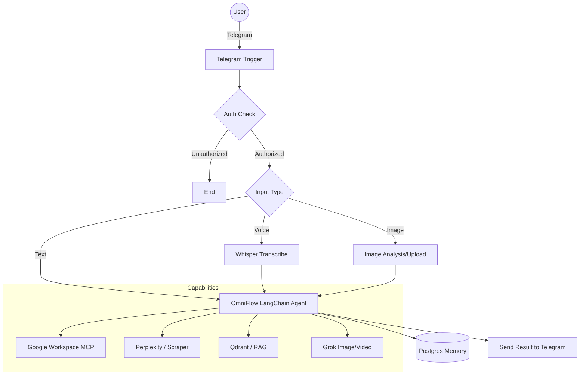

# 🤖 OmniFlow AI: The Ultimate n8n Automation Agent

**OmniFlow AI** is a cutting-edge, multi-modal automation agent built on n8n. It transforms your Telegram into a powerful command center, capable of managing your entire Google Workspace, performing deep web research, and generating high-quality media through a sophisticated LangChain-driven architecture.

---

## 🚀 Key Features

### 🎙️ Multi-modal Command Center
- **Text & Voice**: Interact naturally. Built-in transcription (OpenAI Whisper) converts voice notes into actionable commands.
- **Vision-Ready**: Send images for OCR, analysis, or as context for complex tasks.
- **Secure**: Integrated Telegram User ID verification ensures only authorized users can trigger the agent.

### 💼 Google Workspace Mastery (via MCP)
Deep integration with Google Services via the Model Context Protocol (MCP):
- **📧 Gmail**: Read, send, reply to emails, and manage drafts seamlessly.
- **📅 Calendar**: Check availability, schedule meetings, and manage events.
- **📁 Drive**: Search, move, upload, and download files directly from chat.
- **📝 Docs & Sheets**: Create documents and update spreadsheets on the fly.

### 🔍 Advanced Intelligence & Research
- **Web Intelligence**: Leverages **Perplexity AI** and **ScrapeGraphAI** for real-time web searching and data extraction.
- **Knowledge Base (RAG)**: Integration with **Qdrant** vector database and **Cohere** reranking for high-accuracy retrieval-augmented generation.
- **Media Suite**: Specialized agents for **Grok-powered** image and video generation and editing.

### 🧠 Persistent Memory
- **Postgres Memory**: Remembers your previous interactions across sessions for a truly personalized assistant experience.

---

## 🛠️ Architecture

---

## ⚙️ Prerequisites

To run OmniFlow AI, you will need:
- **n8n** (Self-hosted or Cloud)
- **Telegram Bot Token** (from @BotFather)
- **API Keys**:
    - OpenAI (for GPT-4o/Whisper)
    - Google Gemini (for core LLM)
    - Perplexity AI (for web search)
    - Qdrant (for vector memory)
    - Google Cloud Console Credentials (for Gmail/Drive/etc.)

---

## 📥 Installation

1. Create a new workflow in **n8n**.
2. Click on the menu (three dots) and select **Import from File**.
3. Select `OmniFlow_AI.json` from this repository.
4. Configure your credentials for the nodes (Telegram, OpenAI, Google, etc.).
5. **Activate** the workflow.

---

## 📝 License

Distributed under the MIT License. See `LICENSE` for more information.

---

*Generated with ❤️ by Antigravity*
