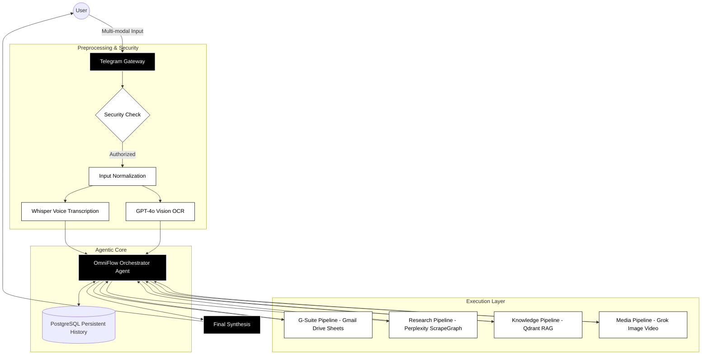

<h1 align="center">OmniFlow AI</h1>

<b>Autonomous Multi-Agent Orchestration & Enterprise Automation Engine</b>

  

  
  
  
  
  
  
  

  
  
  
  
  
  

---

## 📑 Project Overview

**OmniFlow AI** is a professional-grade, autonomous multi-agent system designed for enterprise-level automation. Engineered using the **n8n** framework, it implements a highly-scalable "OpenClaw" orchestration pattern that consolidates fragmented business tools into a single, intelligent interface.

The system acts as an **Autonomous Executive**, interpretating multi-modal inputs (Voice, Text, Vision) and executing complex, cross-platform workflows. By sitting at the intersection of LLM reasoning and professional toolsets, OmniFlow AI automates the "thinking" as well as the "doing," making it a powerful asset for modern AI-driven operations.

---

## 🏗️ Technical Architecture

---

## ⚙️ Core Pipelines

The OmniFlow AI architecture is built around several "High-Throughput Pipelines" that handle specific enterprise tasks:

### 1. **G-Suite Workflow Pipeline**
*   **Purpose**: Complete automation of the Google Workspace ecosystem.
*   **Mechanism**: Uses **Model Context Protocol (MCP)** to bridge n8n with G-Suite APIs.
*   **Capabilities**: Automated draft generation, intelligent calendar conflict resolution, and dynamic documentation synthesis.

### 2. **Cognitive Research Pipeline**
*   **Purpose**: Real-time information gathering and data extraction.
*   **Mechanism**: Chained execution between **Perplexity AI** (for broad search) and **ScrapeGraph AI** (for structured scraping).
*   **Capabilities**: Competitor analysis reports, market trend extraction, and cited source consolidation.

### 3. **RAG & Knowledge Pipeline**
*   **Purpose**: Context-aware retrieval of private enterprise data.
*   **Mechanism**: High-speed vector search via **Qdrant** with **Cohere Reranking** for maximum relevance.
*   **Capabilities**: Private policy querying, internal document search, and personal knowledge base interaction.

### 4. **Multi-modal Input Pipeline**
*   **Purpose**: Seamless handling of diverse communication types.
*   **Mechanism**: Parallel processing of **Whisper** (Audio) and **GPT-4o/Gemini** (Vision/Text).
*   **Capabilities**: Hands-free voice operation, visual document analysis, and complex OCR-based triggers.

---

## 🛠️ Technology Stack

| Stack | Technologies |
| :--- | :--- |
| **Frameworks** | n8n, LangChain |
| **Intelligence** | GPT-4o, Gemini 1.5 Pro, Whisper, Cohere |
| **Databases** | PostgreSQL (History), Qdrant (Vector) |
| **Integrations** | Gmail, Google Drive, Calendar, Google Sheets (Excel), Google Docs, Google Slides |
| **Research** | Perplexity AI, ScrapeGraph AI |
| **Media** | Grok (xAI) |

---

## 💼 Deployment & Configuration

1.  **Workflow Import**: Import the production-ready `OmniFlow_AI.json` into n8n.
2.  **Auth Configuration**: Set your authorized `USER_ID` and Telegram credentials.
3.  **MCP Server Setup**: Connect your MCP servers for Google Workspace endpoints.
4.  **Credential Management**: Securely store API keys for OpenAI, Google, and Perplexity within n8n.

---

## 📄 License
This system is provided under the **MIT License**. It is designed as a template for professional-grade autonomous agent deployments.

---

  <b>Developed for Professional Portfolio Use | n8n Multi-Agent System v1.0</b>

