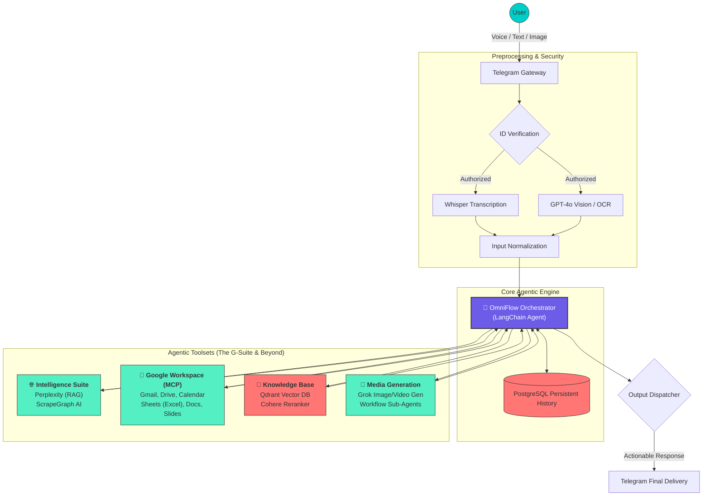

  

  <b>The Ultimate Autonomous Multi-Agent System for Enterprise Automation</b>

---

  
  
  
  
  
  
  

  
  
  
  
  
  

---

## 📖 Executive Summary

**OmniFlow AI** is a professional-grade, autonomous multi-agent orchestration system built on the **n8n** automation framework. Designed as a functional "OpenClaw" simulation, it transforms a standard Telegram interface into a powerful AI command center. 

Unlike traditional chatbots, OmniFlow AI is an **autonomous executive**. It understands complex, multi-modal inputs (Text, Voice, Image) and intelligently delegates tasks to a fleet of specialized sub-agents. Whether it's performing deep market research via Perplexity, managing your entire G-Suite workspace via MCP (Model Context Protocol), or maintaining a long-term memory via Qdrant/Postgres, OmniFlow AI operates with a "Think-Plan-Execute" mindset.

---

## 🏗️ Technical Architecture

The system utilizes a hierarchical agentic design where a central **Orchestrator** manages state, memory, and tool invocation.

---

## 🚀 Professional Capabilities

### 🧠 Autonomous Orchestration (OpenClaw Logic)
The agent doesn't just respond; it **reasons**. Using a multi-step planning phase, it breaks down complex requests (e.g., *"Summarize my last 5 emails and create a Google Doc report with a table and a matching presentation slide"*) into a sequence of tool calls.

### 💼 Enterprise Workspace Integration
- **Google Workspace (G-Suite)**: Deep integration via MCP. Handles complex Excel/Sheets manipulations, Gmail drafting/sending, and automatic Calendar management.
- **RAG (Retrieval-Augmented Generation)**: Uses **Qdrant** and **Cohere** to fetch and rank private information from your documents, ensuring responses are grounded in your specific data.

### 🎙️ Multi-modal Mastery
- **Voice Intelligence**: High-fidelity transcription via **OpenAI Whisper**, enabling hands-free automation.
- **Computer Vision**: Uses **GPT-4o Vision** to analyze photos or screenshots sent via Telegram, triggering workflows based on visual context.

### 🌐 Real-time Web Intelligence
- **Advanced Scraping**: Uses **ScrapeGraph AI** to extract data from modern, JavaScript-heavy websites.
- **Live Research**: Powered by **Perplexity AI** for up-to-the-minute information withdrawal with source citations.

---

## 🛠️ Tech Stack & Tooling

| Category | Technology |
| :--- | :--- |
| **Orchestration** | n8n, LangChain |
| **Logic Engines** | Google Gemini 1.5 Pro, OpenAI GPT-4o |
| **Web Research** | Perplexity AI, ScrapeGraph AI |
| **Vector DB** | Qdrant |
| **Persistence** | PostgreSQL |
| **G-Suite** | Gmail, Google Drive, Calendar, Sheets, Docs, Slides |
| **Media Gen** | Grok (xAI) |

---

## 📥 Deployment Guide

1.  **Repository Setup**: Clone this repository and ensure `OmniFlow_AI.json` is accessible.
2.  **n8n Import**: Create a new workflow in your n8n instance and import the `.json` file.
3.  **Environment Variables**:
    *   Set `TELEGRAM_BOT_TOKEN` and your authorized `USER_ID`.
    *   Configure `GOOGLE_OAUTH` for Workspace access.
    *   Input API keys for OpenAI, Gemini, Perplexity, and Qdrant in the credential manager.
4.  **Active Triggers**: Enable the **Telegram Trigger** and **Schedule Trigger** for autonomous background tasks.

---

## 🛡️ License & Acknowledgments
This project is licensed under the MIT License. Developed as a professional-grade demonstration of autonomous multi-agent systems.

---

  Generated with ❤️ by <b>Antigravity</b> for <b>Vinodhan</b>'s Professional Portfolio

